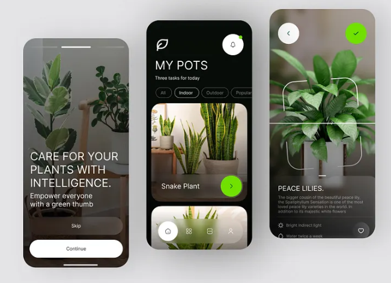

# 📱 Flower Pot App 🍃 - Inspiração do Dribbble
Este é um projetinho que fiz para praticar minhas habilidades no Flutter, baseado em uma inspiração do site [Dribbble](https://dribbble.com/).

## 🎨 Inspiração
Achei essa inspiração no Dribbble e resolvi recriar a interface no Flutter:

## 🚀 O que foi praticado
No desenvolvimento deste aplicativo, coloquei em prática diversos conceitos fundamentais e intermediários do Flutter. Entre os principais pontos aplicados, destacam-se:

* Adição de imagens ao projeto e configuração adequada no pubspec.yaml, garantindo que os assets fossem carregados corretamente e otimizando sua exibição em diferentes tamanhos de tela.
* Exibição e estilização de textos, usando propriedades de estilo como fontWeight, fontSize, color, TextDecoration e alinhamentos.
* Criação e personalização de botões, com ElevatedButton, com ajustes finos de cor, borda, padding e bordas arredondadas.
* Desenvolvimento de widgets personalizados
* Navegação fluida entre telas, utilizando rotas e o Navigator, garantindo transições suaves e intuitivas entre diferentes páginas do app.
* Implementação de mensagens de erro, exibidas de forma clara ao usuário para melhorar a usabilidade e indicar falhas de forma compreensível.

## 🎥 Demonstração
Aqui está um vídeo simples mostrando o projetinho em funcionamento:

## 📌 Tecnologias utilizadas
- Flutter
- Dart

Sinta-se à vontade para explorar o código e usar como referência! 🚀

## 💬 Quer trocar uma ideia sobre Flutter?
Se você também está estudando ou tem interesse na tecnologia, fique à vontade para me chamar! Vamos aprender juntos! 😊

__Esse é o meu Linkedln:__ [Clique aqui!](https://www.linkedin.com/in/rafaela-aparecida-dos-santos-28585a283/)