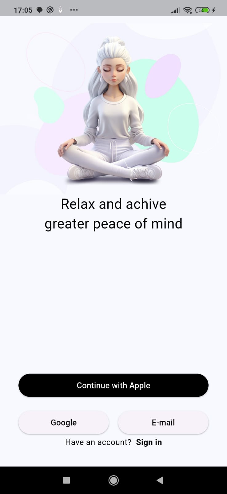

# 📱 Relax App 🍃 - Inspiração do Dribbble
Este é o meu primeiro projetinho que fiz para praticar minhas habilidades no Flutter, baseado em uma inspiração do site [Dribbble](https://dribbble.com/).

## 🚀 O que foi praticado
Durante o processo de criação do aplicativo em Flutter, coloquei em prática conhecimentos essenciais que contribuíram para uma interface funcional e visualmente agradável. Entre os principais aprendizados, destaco:

* Como adicionar e configurar imagens no pubspec.yaml: adicionei assets personalizados ao projeto e realizei a devida configuração no arquivo pubspec.yaml, garantindo que as imagens fossem corretamente carregadas e exibidas na interface.

* Posicionamento e estilização de textos: utilizei widgets como Text e propriedades de estilo (fontSize, fontWeight, color) para garantir títulos impactantes e textos bem alinhados com o layout proposto.

* Implementação de botões interativos.

Foi um ótimo aprendizado! 🚀✨

## 🎥 Demonstração
Aqui está um print simples mostrando o projetinho:

## 📌 Tecnologias utilizadas
- Flutter
- Dart

Sinta-se à vontade para explorar o código e usar como referência! 🚀

## 💬 Quer trocar uma ideia sobre Flutter?
Se você também está estudando ou tem interesse na tecnologia, fique à vontade para me chamar! Vamos aprender juntos! 😊

__Esse é o meu Linkedln:__ [Clique aqui!](https://www.linkedin.com/in/rafaela-aparecida-dos-santos-28585a283/)