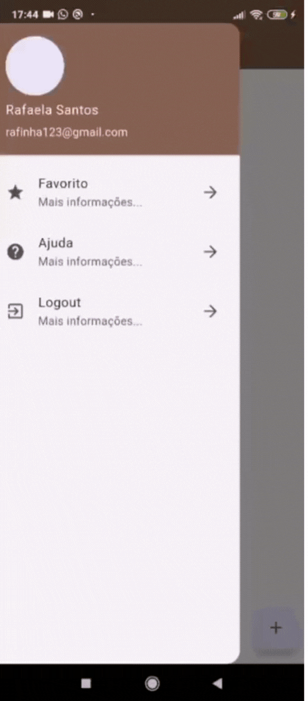

# 📱 Dog App 
Esse projeto foi como um rascunho para colocar em prática tudo o que aprendi no curso. Enquanto assistia às aulas, fui testando cada conceito no código.

## 🚀 O que foi praticado
Durante o desenvolvimento, pude praticar e aprimorar diversas habilidades no Flutter, incluindo:

✅ Como adicionar imagens ao projeto e configurá-las no pubspec.yaml
✅ Exibição e estilização de textos
✅ Criação e personalização de botões
✅ Desenvolvimento de widgets personalizados para reutilização de componentes
✅ Navegação entre telas de forma fluida
✅ Implementação de mensagens de erro para melhorar a experiência do usuário
✅ Uso de TABS para organizar o conteúdo
✅ Construção de listas (ListView) e grids (GridView) dinâmicos
✅ Ajuste de padding e margens para um layout mais harmônico

Cada detalhe foi uma oportunidade de aprendizado! 🚀✨

## 🎥 Demonstração
Aqui está um vídeo simples mostrando o projetinho:

## 📌 Tecnologias utilizadas
- Flutter
- Dart

Sinta-se à vontade para explorar o código e usar como referência! 🚀

## 💬 Quer trocar uma ideia sobre Flutter?
Se você também está estudando ou tem interesse na tecnologia, fique à vontade para me chamar! Vamos aprender juntos! 😊

__Esse é o meu Linkedln:__ [Clique aqui!](https://www.linkedin.com/in/rafaela-aparecida-dos-santos-28585a283/)