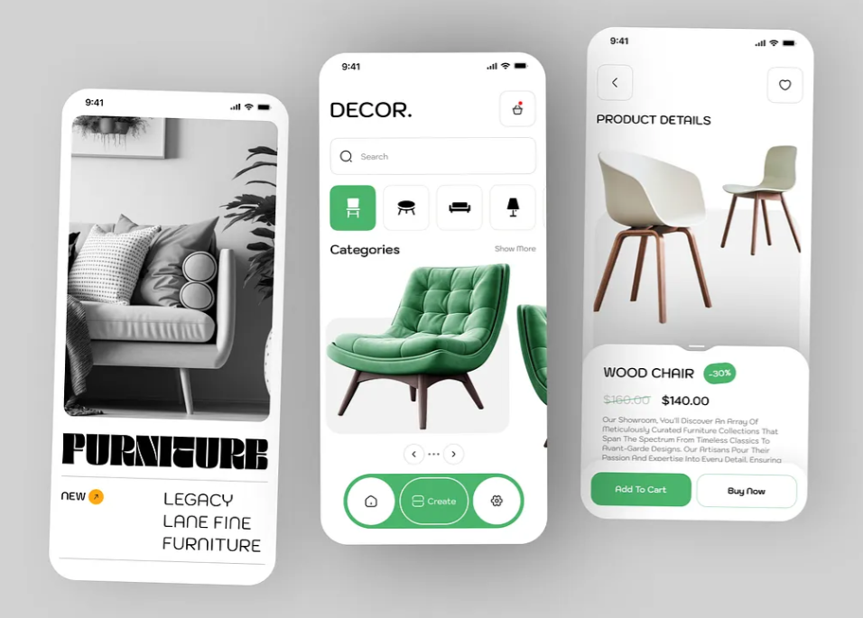
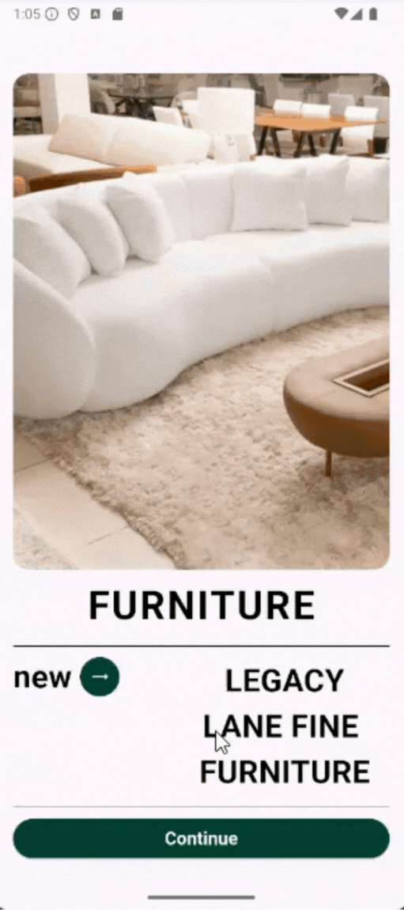

# 📱 furniture sales App - Inspiração do Dribbble
Este é um projetinho que fiz para praticar minhas habilidades no Flutter, baseado em uma inspiração do site [Dribbble](https://dribbble.com/).

## 🎨 Inspiração
Achei essa inspiração no Dribbble e resolvi recriar a interface no Flutter:

## 🚀 O que foi praticado
No desenvolvimento deste aplicativo, coloquei em prática diversos conceitos fundamentais e intermediários do Flutter. Entre os principais pontos aplicados, destacam-se:

* Estruturação da interface com widgets personalizados, como ButtonIcon e ImageCard, para promover reutilização de código e manter a UI limpa e organizada.
* Utilização de AppBar personalizada, com ícones posicionados manualmente (como o botão de favoritos e de voltar), para manter o layout próximo ao design de inspiração.
* Scroll controlado com SingleChildScrollView, permitindo que o conteúdo se adapte bem a telas menores sem overflow.
* Estilização detalhada com Container, Padding, SizedBox e TextStyle, para garantir uma aparência visual refinada, incluindo:
* Cores temáticas (verde para botões e desconto),
* Texto tachado para preços antigos,
* Tipografia personalizada com Google Fonts (BebasNeue).
* Criação de uma área inferior fixa com bordas arredondadas, que simula uma ficha de produto, contendo:
    * Título, preço original e com desconto, Descrição do produto, Botões de ação: “Add to Cart” e “Buy Now”.
* Uso do Expanded e Row para criar botões responsivos e centralizados, respeitando o espaço disponível na tela.
* Aplicação de boas práticas como separação de widgets, padronização visual e coerência de estilo entre os elementos da tela.

Cada detalhe foi uma oportunidade de aprendizado! 🚀✨

## 🎥 Demonstração
Aqui está um vídeo simples mostrando o projetinho:

## 📌 Tecnologias utilizadas
- Flutter
- Dart

Sinta-se à vontade para explorar o código e usar como referência! 🚀

## 💬 Quer trocar uma ideia sobre Flutter?
Se você também está estudando ou tem interesse na tecnologia, fique à vontade para me chamar! Vamos aprender juntos! 😊

__Esse é o meu Linkedln:__ [Clique aqui!](https://www.linkedin.com/in/rafaela-aparecida-dos-santos-28585a283/)