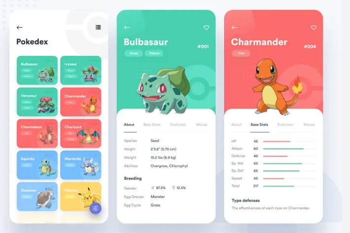
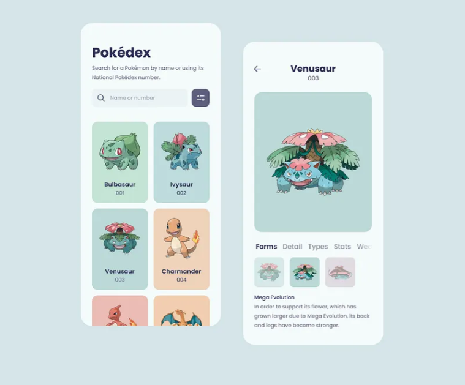
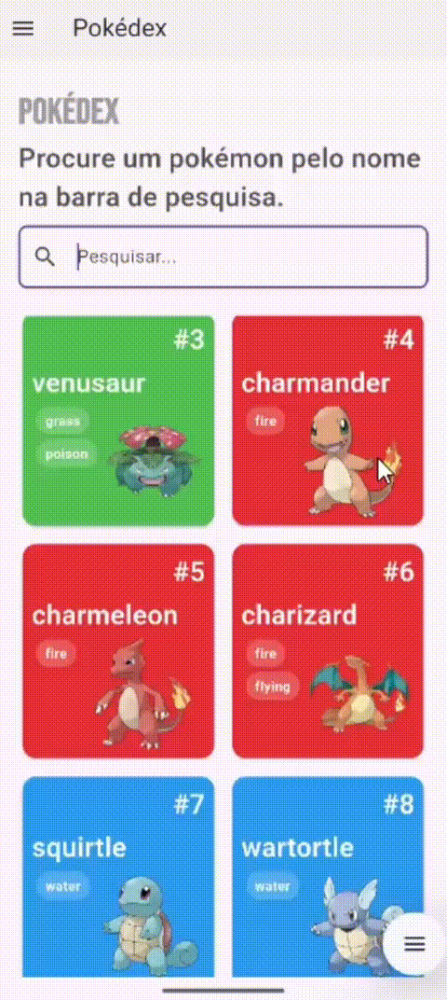

# 📱 Pokédex App 

Este é um projetinho que desenvolvi para praticar e aprofundar meus conhecimentos em Flutter, com base em duas inspirações visuais do site [Dribbble](https://dribbble.com/), além de consumir dados reais da [API pública do Pokémon](https://pokeapi.co/).

## 🎨 Inspiração  
As interfaces deste projeto foram inspiradas em dois designs encontrados no Dribbble. A ideia foi combinar o melhor de cada um e recriar no Flutter com atenção aos detalhes e à usabilidade:

## 🚀 O que foi praticado

Durante o desenvolvimento deste aplicativo, explorei diversos conceitos do Flutter e ferramentas que são amplamente utilizadas em projetos reais. Entre os principais pontos que trabalhei, estão:

- **Arquitetura em camadas**: separei o projeto em camadas como `data`, `domain`, `store` e `ui`, facilitando a organização, manutenibilidade e escalabilidade do código.

- **Consumo de API com Retrofit**: utilizei o pacote [Retrofit](https://pub.dev/packages/retrofit) para integrar com a [PokéAPI](https://pokeapi.co/), simplificando chamadas HTTP e garantindo tipagem segura.

- **Geração de models com Freezed**: usei o [Freezed](https://pub.dev/packages/freezed) para gerar classes imutáveis e com suporte a `copyWith`, `fromJson` e muito mais, tornando o código mais limpo e robusto.

- **Gerenciamento de estado com ChangeNotifier**: apliquei o `ChangeNotifier` do Flutter para controlar os estados da aplicação de forma simples.

- **Persistência local com SQFLite**: implementei o banco de dados local [SQFLite](https://pub.dev/packages/sqflite) para salvar Pokémons favoritos no dispositivo do usuário.

- **Boas práticas**: mantive a separação de responsabilidades, nomeação coerente dos arquivos e widgets reaproveitáveis.

## 📦 Funcionalidades principais

- Listagem dos Pokémons com imagens, nomes e tipos.
- Tela de detalhes características.
- Adição e remoção de favoritos com persistência local.
- Busca por nome.
- Feedback visual de carregamento e erros.

## 🎥 Demonstração

Aqui está um vídeo simples mostrando o app em funcionamento:

## 📌 Tecnologias utilizadas

- **Flutter**
- **Dart**
- **Retrofit** – Para requisições HTTP estruturadas.
- **Freezed** – Para geração de modelos imutáveis.
- **ChangeNotifier** – Para gerenciamento de estado.
- **SQFLite** – Para persistência local dos dados.
- **PokéAPI** – Fonte oficial de dados dos Pokémons.

Sinta-se à vontade para explorar o código e usar como referência! 🚀

## 💬 Quer trocar uma ideia sobre Flutter?
Se você também está estudando ou tem interesse na tecnologia, fique à vontade para me chamar! Vamos aprender juntos! 😊

__Esse é o meu Linkedln:__ [Clique aqui!](https://www.linkedin.com/in/rafaela-aparecida-dos-santos-28585a283/)
